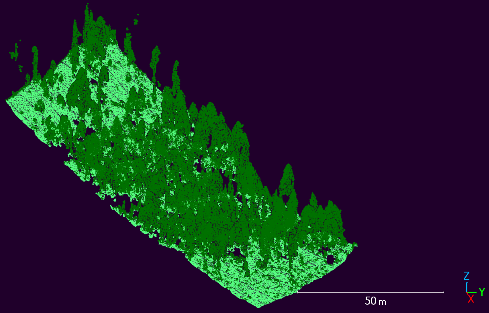

# Code repository (sub-directory) for ground/non-ground classification and height normalization operation

Things to note:
1. The `groundClassif_heightNormalize_PC.R` script in this sub-directory can be used for the ground/non-ground classification of point cloud and height normalization operation.

> ==The methodology and code for this script were prepared using the [lidRbook](https://r-lidar.github.io/lidRbook/chm.html) and the manuscript by [Mohan et al. (2021)](https://www.degruyter.com/document/doi/10.1515/geo-2020-0290/html?lang=en) -- especially the tutorial included in their [supplementary materials (Mohan et al., 2021)](https://www.degruyter.com/document/doi/10.1515/geo-2020-0290/downloadAsset/suppl/geo-2020-0290_sm.pdf)==

2. The `INPUT` for this script is the multispectral point cloud (stored in the `DATA` folder) and the `OUTPUT` is a ground/non-ground classified point cloud with height normaliztion operation  (in the `EXPORTS` folder). 
3. Before running script, make sure to change variables in the `CHANGE VARIABLES HERE` section and any section that is highlighted with `~~~~~~~~~~` or `===========` or `--------------` 

## Examples of results

### Ground/non-ground classification

*Points classified as ground are light green and non-ground points are dark green.*

### Height normalization operation

*(a) Isometric view. (b) side profile view of the results of height normalization operation; the flat areas demonstrate the removal of the influence of terrain.* 

