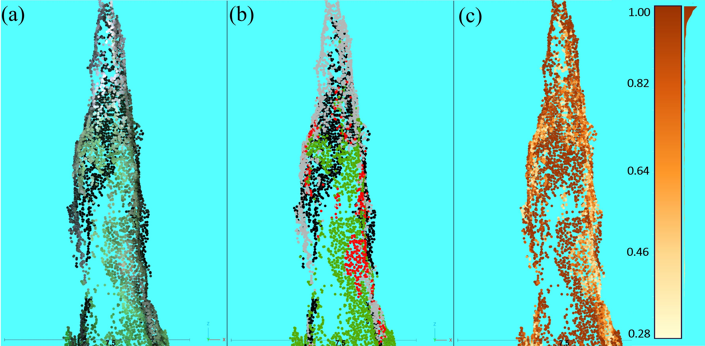

# Code repository (sub-directory) for random forest classification of point cloud

Things to note:
1. There are multple scripts in this sub-directory for the development, evaluation, and application of random forest (RF) model to classify the point cloud into healthy (green), damaged (red, gray), and shadow class points. The script titles include numbers that outline the progression of this RF classification of point cloud stage in the methodology.
2. The `01_create_ReferenceData_POINTS.R` script is for creating and analyzing the reference data set of points.
3. The `02_RF_diagnostics_bestSubsetsApproach.R` script is for producing RF models with different predictor variable subsets with rankings (`BEST SUBSETS APPROACH`).
4. The `03_analyzeBestSubsets_RFmodels.R` script is to evaluate the performaces of RF models from the `02_RF_diagnostics_bestSubsetsApproach.R` script (evaluate results of the `BEST SUBSETS APPROACH`) to select the final RF model.
5. The `04_applyRF_2_treeSegPC.R` script is to apply the final RF model to the study area point cloud. 
6. The `DATA` and `EXPORTS` sub-directories contain relevant files that are `INPUT` and `OUTPUT` for the scripts in this folder.
7. Before running script, make sure to change variables in the `CHANGE VARIABLES HERE` section and any section that is highlighted with `~~~~~~~~~~` or `===========` or `--------------` 
8. The `errorAccuracyOutputs_function.R` is a custom function sourced in multple scripts in this sub-directory. This function takes object of class `randomForest` as `INPUT` and returns the confusion matrix and accuracy metrics of the RF model as `OUTPUT`. 

## Summary of methodology

### Classification of points based on reflectance using random forest models

#### Assembling reference data of points

* The reference data of points was assembled using a subset of the point cloud that contains points with unique `ID_point` created using the `01_create_ReferenceData_POINTS.R` script.
* The unique `ID_point` linked the collection of reference points in the subset point cloud to their reference classes (**green**, **red**,  **gray**, **shadow**).

 
 
 
 

#### Application of random forest model

* Various random forest (RF) models were developed with the "best subsets" approach using the `02_RF_diagnostics_bestSubsetsApproach.R` script.
* The resulting best subsets of RF models quantitatively assessed with the `03_analyzeBestSubsets_RFmodels.R` (*not shown in animation*).
* The top performing RF models were applied to a reference data set of trees and qualitatively evaluated to select the final RF model (*not shown in animation*).
* The final RF model was applied to the entire study area.

 

### Point classification on example tree

*Classification probability (from application of the random forest (RF) model) of an example tree. (a) True color representation of the point cloud. (b) RF classification; green is healthy, red is red, gray is gray, and black is shadow. (c) The probabilities of classes shown in (b); darker colors represent higher probabilities of classification.*
