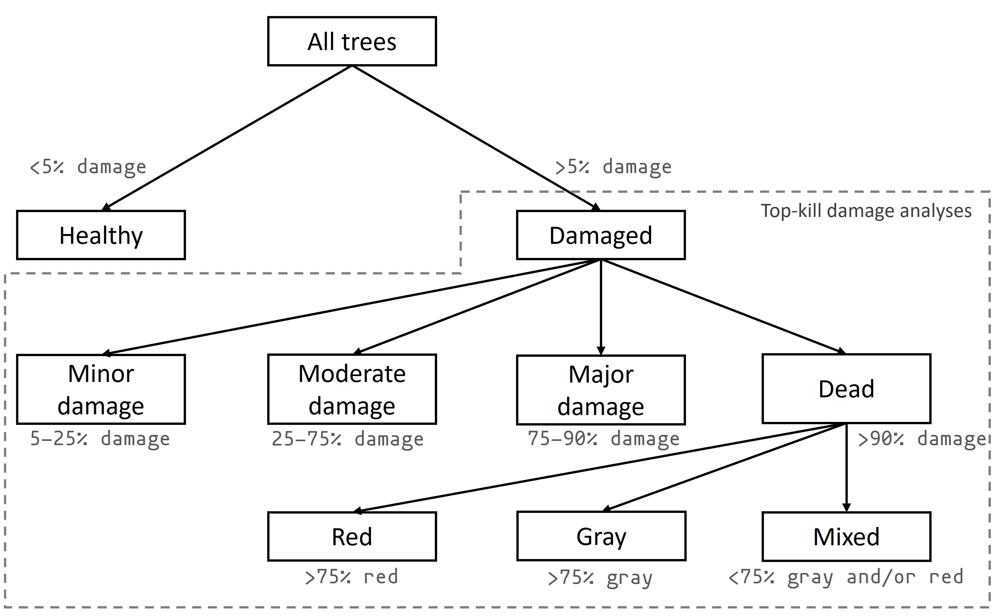
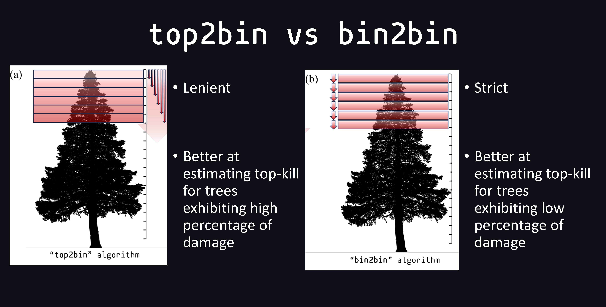
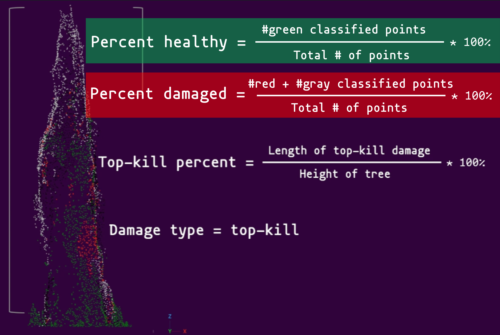

# Code repository (sub-directory) for the tree damage algorithm 

## Sub-directory information:
1. There are multple scripts in this sub-directory to analyze damage on individual trees in the study area and identify the damage type. The script titles include numbers that outline the tree damage stage of the project's methodology.
2. The `01_assessDamage_RFClassified_PointCloud.R` script executes the tree damage algorithm that computes the damage metrics of each tree, identfies damage severity based on damage metric, and estimates top-kill damage. The `INPUT` for this script is the RF classified point cloud (with tree segmentation) and the `OUTPUT` of this script is the tree crown polygons with damage metrics and damage type of each tree. 
3. The `02_damageAssessment_summariesBySite.R` script summarizes tree damage of the study area. This script requires sourcing the `damageAssessSummary_function.R` script to load the custom function that uses the tree crown polygons with damage metrics and damage type of each tree as `INPUT` and returns a `data.table` with damage summaries.
4. The `03_mean_RFmaxProb_perTree.R` script computes the average RF classification probability of each tree.
5. The `04_spatAgg_treeDamagePolygons.R` script spatially aggregates tree-level damage metrics to specified grid cell size.
6. The `damageAssessSummary_function.R` is a custom function that summarizes damage assessment shapefile created from the tree-lvel damage assessment algorithm. 
7. The `DATA` and `EXPORTS` sub-directories contain relevant files that are `INPUT` and `OUTPUT` for the scripts in this folder.
8. Before running script, make sure to change variables in the `CHANGE VARIABLES HERE` section and any section that is highlighted with `~~~~~~~~~~` or `===========` or `--------------` or `**********` 

## Tree damage algorithm information

### Classification tree of damage serverity classes

<em>Classification tree used for the separation of trees into healthy, damaged, and different damage severities. “Damage” refers to the sum of red and gray points on each tree. The area with dashed lines indicates the damage severities for which the top-kill algorithms (“top2bin” and “bin2bin”) were applied</em>
  

### Top-kill detection and assessment algorithms

There are two top-kill algorithms implemented for this project: `top2bin` and `bin2bin`. Both algorithms begin at the top of the tree and progresses downward. Details for the each algorithm are as follows:

#### `top2bin`  

* The `top2bin` algorithm assesses the percentage of damage points within a set of height bins from the top of the tree to a given height. 
* For example: 
    * if a tree is 10 m tall, the `top2bin`  algorithm assesses damage from 10 m above the ground to 9.75 m above ground (0.25 m bin) for the first set of bins (consisting of one 0.25-m bin).
    * Then, the algorithm assesses damage from 10 m above ground to 9.5 m above ground for the second set (consisting of two 0.25-m bins). 
    * The algorithm halts when the percentage of damaged points within a set of bins is below a threshold. 

#### `bin2bin`

* The `bin2bin` algorithm assesses the percentage of damage points for each height bin beginning at the top of the tree and progressing downward. 
* For example:
    * if the tree is 10 m tall, the `bin2bin` algorithm assesses damage from 10 m above ground to 9.75 m above ground for the first bin. 
    * Then, the algorithm assesses damage from 9.75 m above ground to 9.5 m above ground for the second bin. 
    * The algorithm halts when the percentage of damaged points within a bin is below a threshold.  

 
 

#### Summary of tree damage metrics:  
